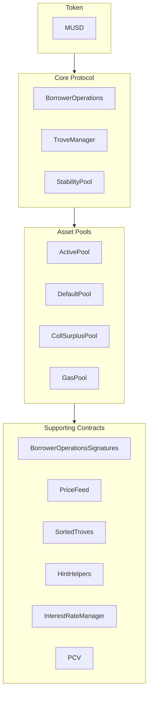

MUSD is a Bitcoin-backed stablecoin that provides a stable value store while maintaining Bitcoin's security and decentralization. This guide covers the core architecture of MUSD and how to integrate with its smart contracts. MUSD is a collateralized debt position (CDP) based on [Threshold USD](https://github.com/Threshold-USD/dev), which is a fork of [Liquity](https://github.com/liquity/dev).

## Architectural Overview

The protocol allows Bitcoin holders to mint MUSD by using their BTC as collateral. This means users can access USD-denominated liquidity while keeping their Bitcoin investment intact. The primary components are how the system handles **custody**, maintains the **price peg**, and earns **fees**.

### Custody

A user opens up a position by calling `BorrowerOperations.openTrove`, providing BTC, and requesting MUSD. The BTC is routed to the `ActivePool`, where it stays until a user either:

- withdraws (via `BorrowerOperations.withdrawColl`).
- pays off their debt (via `BorrowerOperations.closeTrove`).
- is redeemed against (via `TroveManager.redeemCollateral`).
- gets liquidated (via `TroveManager.liquidate`).

Liquidated positions are either paid for by the `StabilityPool`, in which case the BTC is transferred there, or the debt and collateral are absorbed and redistributed to other users, in which case the BTC is transferred to the `DefaultPool`.

### Maintaining the Peg

We maintain the **price floor of \$1** through arbitrage, an external USD ↔ BTC price oracle, and the ability to redeem MUSD for BTC at a 1:1 rate (via `TroveManager.redeemCollateral`). Imagine that MUSD was trading for `$0.80` on an exchange and that bitcoin is selling for `1 BTC = $100k`. An arbitrageur with `$800` could:

1. Trade `$800` for `1000 MUSD`.
2. Redeem `1000 MUSD` for `0.01 BTC` (`$1000` worth of BTC).
3. Sell `0.01 BTC` for `$1000`.

The arbitrageur profits `$200` (ignoring fees). This trade **buys** MUSD and **burns** it, causing upward price pressure until the price resets to `$1`.

We maintain a **price ceiling of \$1.10** via the minimum 110% collateralization ratio. Imagine that MUSD is trading for `$1.20` on an exchange, and that bitcoin is selling for `1 BTC = $100k`. An arbitrageur with `$100k` could:

1. Buy `1 BTC` (worth `$100k`).
2. Open a trove with `1 BTC` as collateral and borrow the maximum `90,909 MUSD`.
3. Sell `90,909 MUSD` for `$109,091`.

The arbitrageur profits `$9,091` (ignoring fees). This trade **sells** and **mints** MUSD, causing downward price pressure until the price reaches `$1.10`.

### Fees

The protocol collects fees in four places:
- A borrowing rate of 0.1% (governable), which is added as debt to a trove but minted to governance.
- A redemption rate of 0.75% (governable), which is taken whenever a user redeems MUSD for BTC.
- A refinancing rate, which operates like the borrowing rate.
- Simple, fixed interest on the principal of the loan.

## Core Ideas

### Protocol Bootstrap Loan & Stability Pool

Unlike protocols that incentivize stability pool deposits with token rewards, MUSD's Stability Pool is initially populated with a bootstrapping loan. This MUSD can only be used for liquidations. When the protocol's MUSD is used in a liquidation, it is first used to repay any outstanding protocol loan balance, ensuring the bootstrap loan cannot be withdrawn. Repayments on this loan are anticipated to be made weekly.

### Protocol Controlled Value (PCV)

Over time, as the protocol accrues interest and fees, the bootstrap loan gets repaid, and the portion of the MUSD in the Stability Pool that is Protocol Controlled Value increases. The PCV contract manages the distribution of accrued MUSD from interest and fees, with the split between loan repayment and a fee recipient being governable.

### Immutability and Upgradability

MUSD smart contracts are upgradable to allow for fixes. Substantial changes would require deploying a new set of contracts and having users opt-in to migrate, ensuring user control. Once battle-tested, the contracts will be made immutable.

## Repository Structure

The [MUSD repository](https://github.com/mezo-org/musd.git) contains:

- **[Smart Contracts](https://github.com/mezo-org/musd/tree/main/contracts)**: Core MUSD protocol contracts
- **[Integration Examples](https://github.com/mezo-org/musd/tree/main/examples)**: Sample implementations
- **[Testing Suite](https://github.com/mezo-org/musd/tree/main/test)**: Comprehensive test coverage
- **[Documentation](https://github.com/mezo-org/musd/tree/main/docs)**: Technical specifications

## Development Setup

### Prerequisites

- Node.js 18+ (check [`.nvmrc`](https://github.com/mezo-org/musd/blob/main/.nvmrc) for exact version)
- pnpm package manager
- Foundry for smart contract development
- Git

### Installation

1.  Clone the repository:
    ```bash
    git clone https://github.com/mezo-org/musd.git
    cd musd
    ```
2.  Install dependencies:
    ```bash
    pnpm install
    ```
3.  Set up environment:
    ```bash
    cp .env.example .env
    # Edit .env with your configuration
    ```

## System Overview

The MUSD system consists of four main contract groups:



-   **Core Protocol**: Handles main operations like opening/closing positions and managing collateral.
-   **Asset Pools**: Manages the system's various collateral and liquidity pools.
-   **Supporting Contracts**: Provides services like price feeds, remote trove management, and PCV.

## Integration Guide

### Opening a Trove

For optimal gas efficiency, provide hints for the trove's insertion position in the sorted list.

```typescript
async function openTroveWithHints(
  contracts: {
    borrowerOperations: Contract,
    troveManager: Contract,
    sortedTroves: Contract,
    hintHelpers: Contract
  },
  wallet: Wallet,
  debtAmount: bigint,
  assetAmount: bigint
) {
  // Compute expected total debt by adding gas compensation and fee
  const gasCompensation = await contracts.troveManager.MUSD_GAS_COMPENSATION();
  const expectedFee = 
    await contracts.borrowerOperations.getBorrowingFee(debtAmount);
  const expectedTotalDebt = debtAmount + expectedFee + gasCompensation;

  const nicr = (assetAmount * BigInt(1e20)) / expectedTotalDebt;

  const { '0': approxHint } = await contracts.hintHelpers.getApproxHint(nicr, 15, 42);

  const { '0': upperHint, '1': lowerHint } =
    await contracts.sortedTroves.findInsertPosition(nicr, approxHint, approxHint);

  await contracts.borrowerOperations
    .connect(wallet)
    .openTrove(debtAmount, upperHint, lowerHint, { value: assetAmount });
}
```

### Adjusting and Closing Troves

You can similarly adjust (`adjustTrove`) or close (`closeTrove`) troves. Convenience functions are also available for withdrawing/repaying MUSD and adding/withdrawing collateral. For complete examples, see the [demo test file](https://github.com/mezo-org/musd/blob/main/test/integration/Demo.test.ts).

## Liquidations

When a trove's collateralization ratio falls below 110%, it can be liquidated by anyone. The liquidator is rewarded with a gas compensation and a percentage of the trove's collateral.

### Liquidation Flows

1.  **With Stability Pool**: The Stability Pool's MUSD is burned to cover the debt, and it seizes the collateral.
2.  **Partial Stability Pool**: If the pool is insufficient, it covers what it can, and the remaining debt/collateral is redistributed to other active troves.
3.  **Empty Stability Pool**: All debt and collateral are redistributed to other active troves.

### Executing a Liquidation

```typescript
async function liquidateTrove(
  troveManager: Contract,
  wallet: Wallet,
  borrowerAddress: string
) {
  await troveManager.connect(wallet).liquidate(borrowerAddress);
}

async function batchLiquidate(
  troveManager: Contract,
  wallet: Wallet,
  troveAddresses: string[]
) {
  await troveManager.connect(wallet).batchLiquidateTroves(troveAddresses);
}
```

## Redemptions

Any MUSD holder can redeem their tokens for an equivalent value of BTC, which helps maintain the `$1` peg. The system redeems against the trove with the lowest collateral ratio.

For step-by-step instructions and code, see the dedicated guide:

- [MUSD Redemptions](/docs/developers/musd/musd-redemptions/)

## Borrower Risks

-   **Liquidation Risk**: Your collateral can be liquidated if its value falls below 110% of your debt.
-   **Redemption Risk**: Your collateral can be redeemed to maintain the peg, causing a taxable event and loss of upside exposure.
-   **Bad Debt**: In extreme cases, bad debt could be socialized across other borrowers.

## Testing

```bash
# Run all tests
pnpm test

# Run with gas reporting
pnpm test:gas

# Run with coverage
pnpm coverage
```

## Key Changes from THUSD

-   **Fixed-Interest Borrowing**: Interest rates are fixed when a trove is opened and can be refinanced.
-   **Protocol Controlled Value (PCV)**: Manages fees for loan repayment and other system needs.
-   **EIP-712 Signature Verification**: Allows for gasless transaction authorizations.
-   **No Special Recovery Mode Liquidations**: Liquidations follow a single process.

## Definitions

-   **Trove**: A collateralized debt position (CDP).
-   **ICR**: Individual Collateralization Ratio of a single trove.
-   **TCR**: Total Collateralization Ratio of the entire system.
-   **Recovery Mode**: Activated if TCR falls below 150%, enforcing stricter borrowing rules.

## Additional Resources

-   **[MUSD Main README](https://github.com/mezo-org/musd/blob/main/README.md)** - Comprehensive architectural overview.
-   **[Demo Test Suite](https://github.com/mezo-org/musd/blob/main/test/integration/Demo.test.ts)** - Working code examples.
-   **[MUSD User Guide](/docs/users/musd/)** - End-user documentation.
